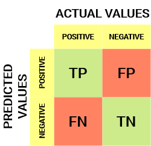
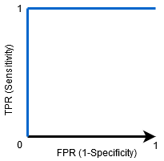

# "Histopathologic Cancer Detection"

## Contexte du projet : 
Problème de computer vision ayant pour but la détection du cancer en identifiant les tissus métastatiques à partir d'images de Microscopies-Scanner de lames de ganglions lymphatiques grâce au Deep Learning.
Les images sont obtenues à partir  d'examens microscopiques de biopsies chirurgical qui traitées et fixées sur des lames de verre. Pour visualiser les différents composants du tissu sous un microscope, les coupes sont teintées avec de l’hématéine (teint le noyau des celles en bleu, violet très foncée) et l’éosine (colore le cytoplasme en rose).

### Motivation :
Les ganglions lymphatiques sont de petites glandes qui filtrent le liquide dans le système lymphatique et ils sont le premier endroit où un cancer du sein est susceptible de se propager. L'évaluation histologique des métastases des ganglions lymphatiques fait partie de la détermination du stade du cancer du sein dans la classification TNM (système international classant les cancers selon leur extension anatomique ).

La procédure de diagnostic pour les pathologistes est fastidieuse et longue car il faut examiner une grande surface de tissu et il est facile de ne pas détecter de petites métastases.

C'est pourquoi l'utilisation de l'apprentissage automatique est un choix judicieux, tant en termes de précision que de facilité d'utilisation. 

### Données à disposition 

Les données sont composées de 220 025 images d'entrainements et le jeu de test est composé de 57 468 images.

Indication de Kaggle sur les images à disposition :

" L'ensemble de données original du PCam contient des images dupliquées en raison de son échantillonnage probabiliste, cependant, la version présentée sur Kaggle ne contient pas de doublons. Par ailleurs, nous avons conservé les mêmes données et les mêmes splits que le référentiel PCam. Vous prévoyez les étiquettes des images dans le dossier de test. Une étiquette positive indique que la région centrale 32x32px d'un patch contient au moins un pixel de tissu tumoral. Le tissu tumoral dans la région extérieure du patch n'a pas d'influence sur l'étiquette. Cette région extérieure est prévue pour permettre des modèles entièrement convolutionnels qui n'utilisent pas de rembourrage zéro, afin d'assurer un comportement cohérent lorsqu'ils sont appliqués à une image complète."

## Métrique utilisée : Courbe ROC-AUC
Mesure de performance pour les problèmes de classification : mesure la capacité du modèle à distinguer les images de coupes presentant des cellules cancéreuses et les images de coupes ne presentant pas de cellules cancereuses 

### Construction courbe ROC-AUC

Une courbe ROC (receiver operating characteristic) est un graphique représentant les performances d'un modèle de classification pour tous les seuils de classification. Cette courbe trace le taux de vrais positifs en fonction du taux de faux positifs :
Vrais positives, vrais négatives, faux positifs, faux negatifs calculés à partir de la matrice de confusion :

* Taux de vrais positifs (TVP)= > Sensibilité

  Sensibilité = (vrai positif)/(vra positifs+faux negatifs)
  
*	Taux de faux positifs => 1 - Specificité

  TFP= faux positifs/(faux positifs+vrai negatifs)
  

Avec une Ric_Auc de cette forme (AUC =1), alors le modèle distingue parfaitement les classes positives et negatives.

Lorsque AUC = 0.5, le classificateur prédit une classe aléatoirement 

Ainsi, plus la valeur AUC d'un classificateur est élevée, meilleure est sa capacité à faire la distinction entre les classes positives et négatives.

### Sensibilité et Spécificité

En médecine, la sensibilité d'un test diagnostic est ainsi sa capacité à détecter un maximum de malades (c'est-à-dire à avoir le moins de faux négatifs), tandis que la spécificité d'un test est sa capacité à ne détecter que les malades (avoir le moins de faux positifs).

### La Roc-AUc peut elle etre pour tous les modèles binaires ?

* A ne pas utiliser c'est l'echelles dans notre jeu de données est important dans l'interprétation
* Pas utlisale dans le cas ou l'écart entre faux positifs et faux negatifs est important et qu'il est souhaitable de minimiser l'un des types d'erreur de classification

### Interet d'utiliser cetté métrique dans notre cas : 

Une courbe ROC trace les valeurs TVP et TFP pour différents seuils de classification. Si l'on diminue la valeur du seuil de classification, alors le modèle classera plus d'éléments comme positifs, ce qui augmente le nombre de faux positifs et de vrais positifs. Le modèle sera performant pour déceler les cas positifs. L’interet dans ce cas c’est que le modèle aura moins de chanche de classer des images cancereurses comme non cancereuses.

Problème : si un cas est negatif, il risquera d’etre classé comme positif (sera donc  un faux positif) 

## Optimisation utilisée : optimisation Adam 

Méthode d'optimisation stochastique : technique mettant en œuvre un taux d'apprentissage adaptatif distinct pour chaque paramètre.

Les paramètres qui recevraient normalement des mises à jour plus petites ou moins fréquentes reçoivent des mises à jour plus importantes avec Adam (l'inverse est également vrai). Cela accélère l'apprentissage dans les cas où les taux d'apprentissage appropriés varient selon les paramètres. 

Par exemple, dans les réseaux profonds, les gradients peuvent devenir petits aux premières couches et il est judicieux d'augmenter les taux d'apprentissage pour les paramètres correspondants. Un autre avantage de cette approche est que, comme les taux d'apprentissage sont ajustés automatiquement, le réglage manuel devient moins important. 

Remarque pour la lecture du notebook si impossible de lire via github : lecture via collab/github/yasminef98

